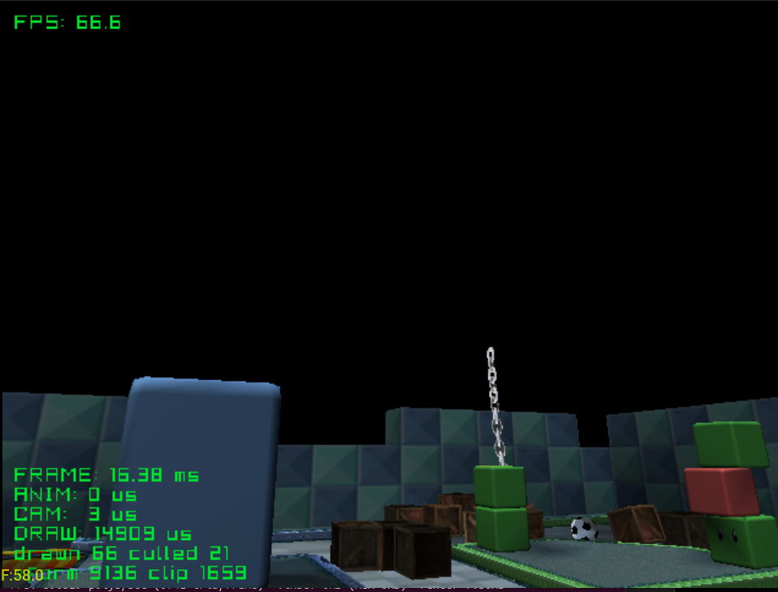
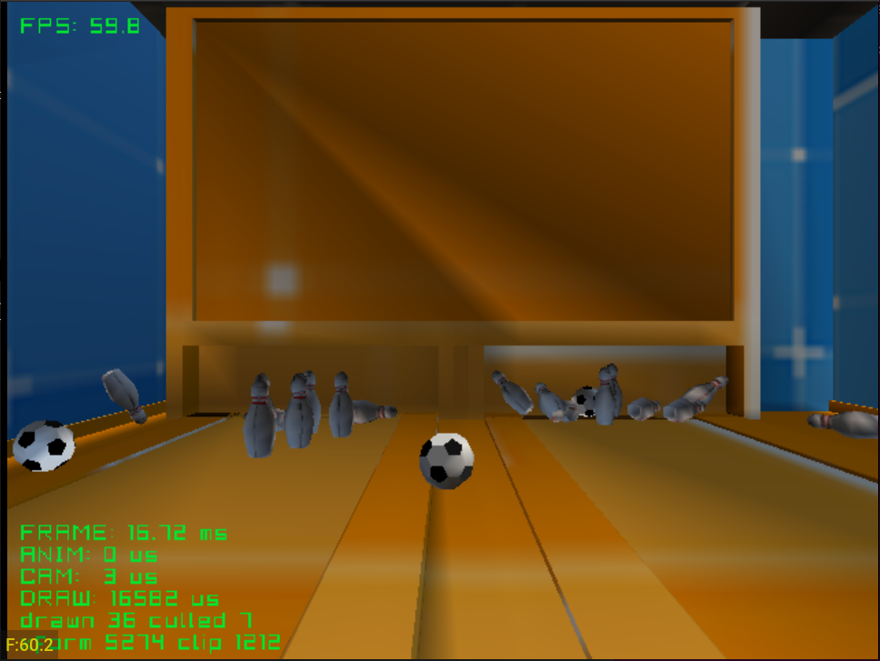
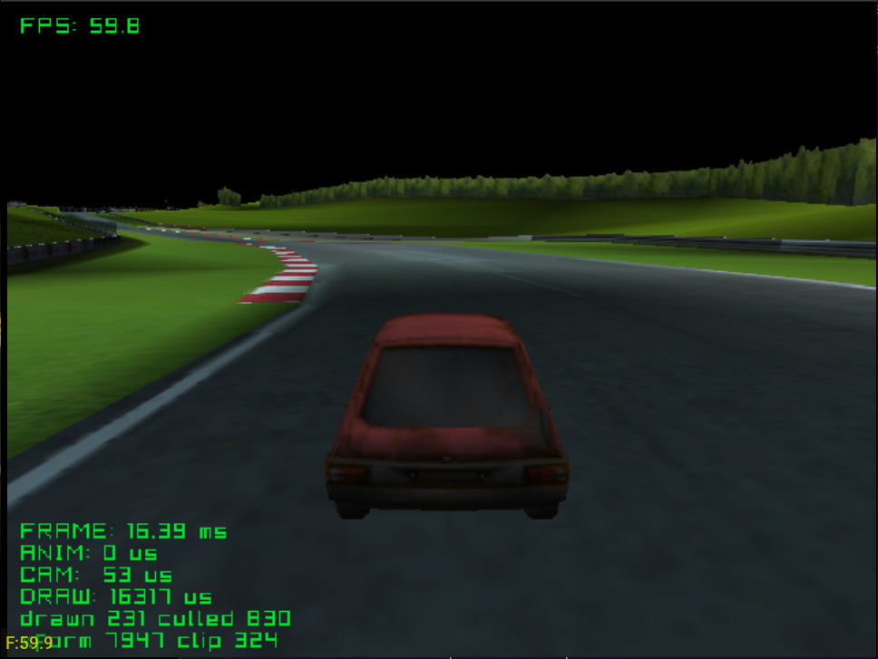
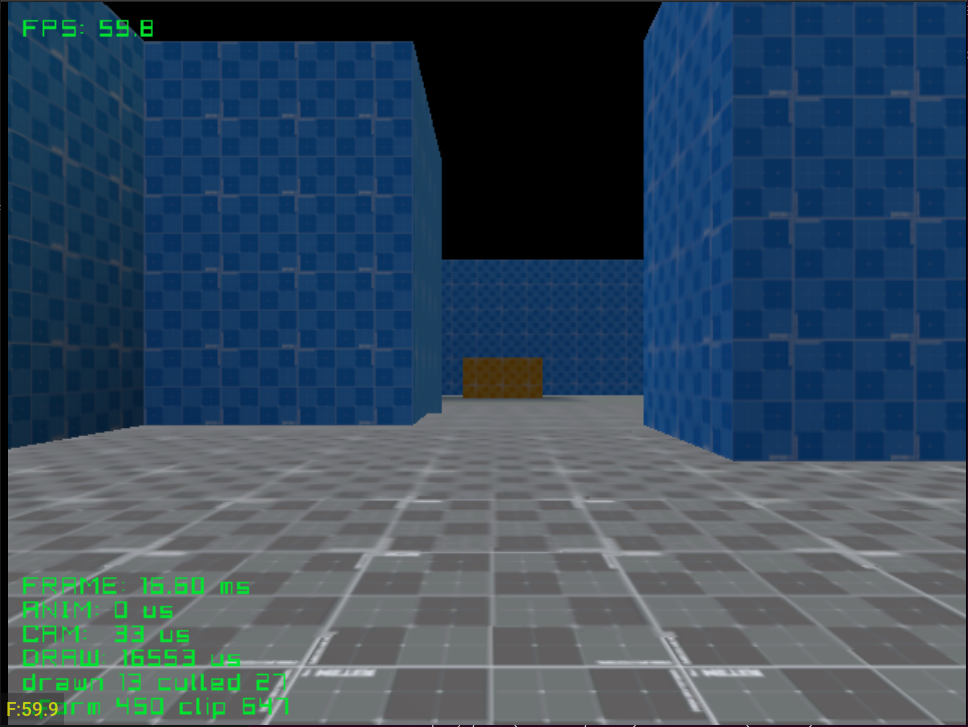
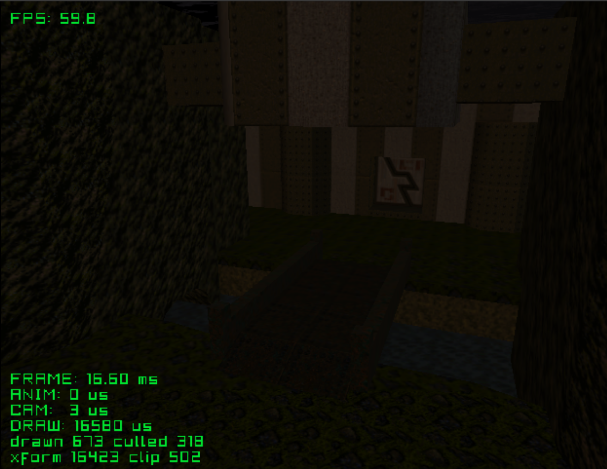
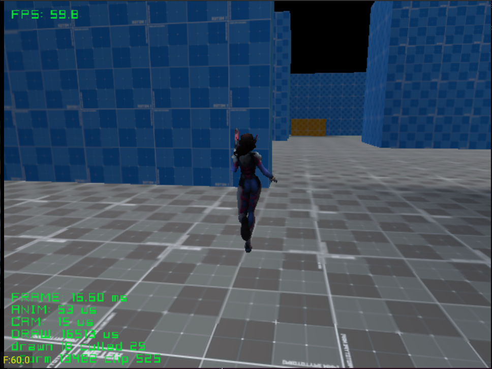
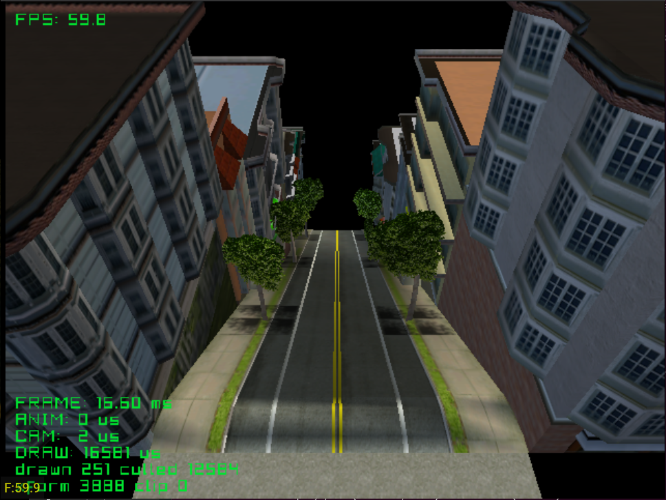
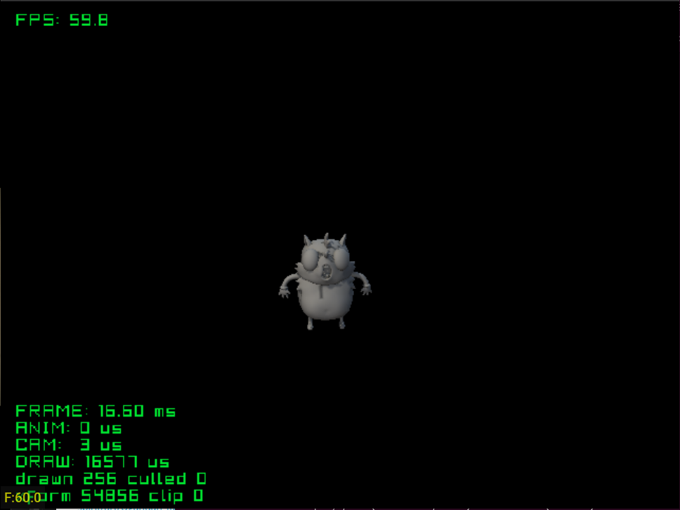

# DMS-Engine

A 3D engine for the Sega Dreamcast, built on KallistiOS and sh4zam. Models are
converted from `.glb` to the engine's `.dms` format with the converter in
`converter/`.

## Building an example

Each example is its own folder with a `Makefile`, a `main.c` and an `assets/`
folder of `.glb` files.

| Command | What it does |
|---|---|
| `make assets` | Converts `assets/*/*.glb` into `pc/` |
| `make` | Builds `test.elf`. Assets are read over dcload from `/pc/` (run `dc-tool` with `-c pc`) |
| `make disc` | Builds `test.elf` reading from `/cd/`, and a `.cdi` named after the folder with `pc/` as the disc root (needs `mkdcdisc`) |

## Examples

### picophysics



Rigid body physics.
(`dms/picophysics.h`). Bodies collide with the level through the engine's
collision grid. A crate and a ball drop at the start, and a wrecking ball
swings on a chain of 14 jointed links.

| Button | Action |
|---|---|
| A | Throw a ball |
| X | Throw a crate |
| Y | Reset |
| Start | Exit |

Credits:
- Level: [GameCube - Mario Kart Double Dash - Block City](https://sketchfab.com/3d-models/gamecube-mario-kart-double-dash-block-city-9d8002b53a884d0290759f05694a49c3)
  by [jkimmel694](https://sketchfab.com/jkimmel694)
- Ball, crate, chain: to add

### bowling



Ten-pin bowling with picophysics. Two lanes of ten pins, and balls rolled from
the camera.

| Button | Action |
|---|---|
| A | Roll a ball |
| Y | Reset the pins |
| Start | Exit |

Credits: to add

### race_track



A large racing track with a car, third-person camera and collision. The
track is close to a worst case for per-mesh overhead: many materials spread
over many small meshes.

Credits:
- Track: [nurburgring (race driver grid ds)](https://sketchfab.com/3d-models/nurburgring-race-driver-grid-ds-fc6393b88aa64fc98e63ee65846d3fc3)
  by [amogusstrikesback2](https://sketchfab.com/amogusstrikesback2)
- Car: to add

### 1st_person



First-person walk through a level with collision. Stresses the near-plane
clipper, since walls and floors are always crossing the camera.

### e1m1



Free camera through Quake's first level, The Slipgate Complex. An indoor
level with baked vertex lighting.

Credits:
- Level: [Quake E1M1 - The slipgate complex](https://sketchfab.com/3d-models/quake-e1m1-the-slipgate-complex-73b496882bce49bb975300ab38295a0b)
  by [barney86](https://sketchfab.com/barney86)

### animation



A skinned, animated character (stand, walk, attack on X) in a level, with a
third-person camera and collision.

Credits:
- Character: [D.Va Base Default - HotS](https://sketchfab.com/3d-models/dva-base-default-hots-ead4a55a18e145338196e10ce4193820)
  by [Catholomew](https://sketchfab.com/Catholomew)

### sonic_streets



Free camera over City Escape from Sonic Adventure 2. A general draw and
culling stress test.

Credits:
- Level: [City Escape - Sonic Adventure 2](https://models.spriters-resource.com/dreamcast/sonicadventure2/asset/297940/)
  ripped by dshaynie, The Models Resource

### highpoly



Free camera over a high-poly model (about 40,000 triangles on screen), to find
the polygon rate limit: about 2.3 million polygons a second. 


Credits:
- Model: [[Free] Ugandan Tails](https://sketchfab.com/3d-models/free-ugandan-tails-cd6dca09d7ed4838b6c0d71c5adc448c)
  by [LuAnton](https://sketchfab.com/LuAnton)

## Blender settings

Export as `.glb`. The converter reads these from the material (Principled
BSDF):

| Setting | What it does |
|---|---|
| Base Color, and its texture | The colour and texture of the mesh |
| Alpha, or a texture with alpha | Soft alpha makes the mesh transparent, hard alpha makes it a cutout |
| Backface Culling | Off means double sided |
| Metallic, 0.5 or more | The mesh reflects the environment image |
| Roughness, under 0.25 | With Metallic: a mirror |
| Emission | With `-bake`, the material lights the things around it |

IOR and the other settings are ignored.

### Reflections

Set Metallic to 1 on the material.

- A solid material with Roughness at 0 is a mirror: it shows the environment
  image in place of its own texture, tinted by its Base Color.
- A solid material with more Roughness keeps its texture and gets a shine
  over it.
- A see-through material (glass) gets a reflection, cut out by the alpha of
  its texture.

In the example, load the image to reflect and hand it to the engine once:

```c
DCImage* environment = dc_image_load(ASSETS "environment/environment.dt");
dc_set_environment(environment);
```

`make assets` turns `assets/<dir>/<name>.png` into the `.dt`. Without the
`dc_set_environment` call, metallic materials draw as normal. See `vase`.
