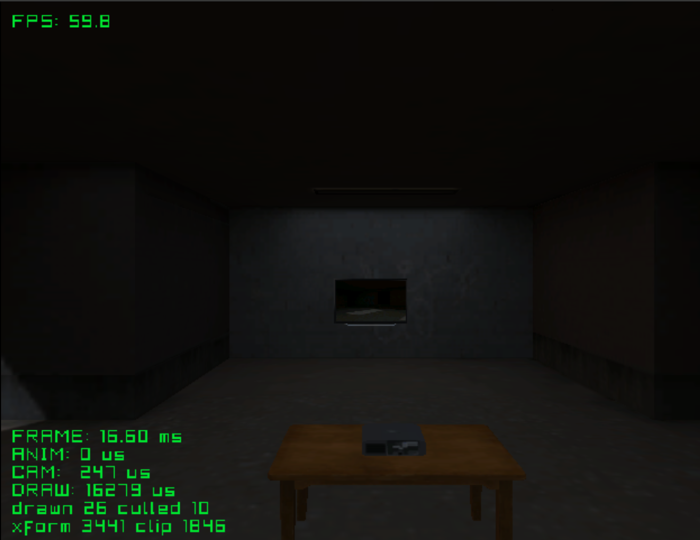
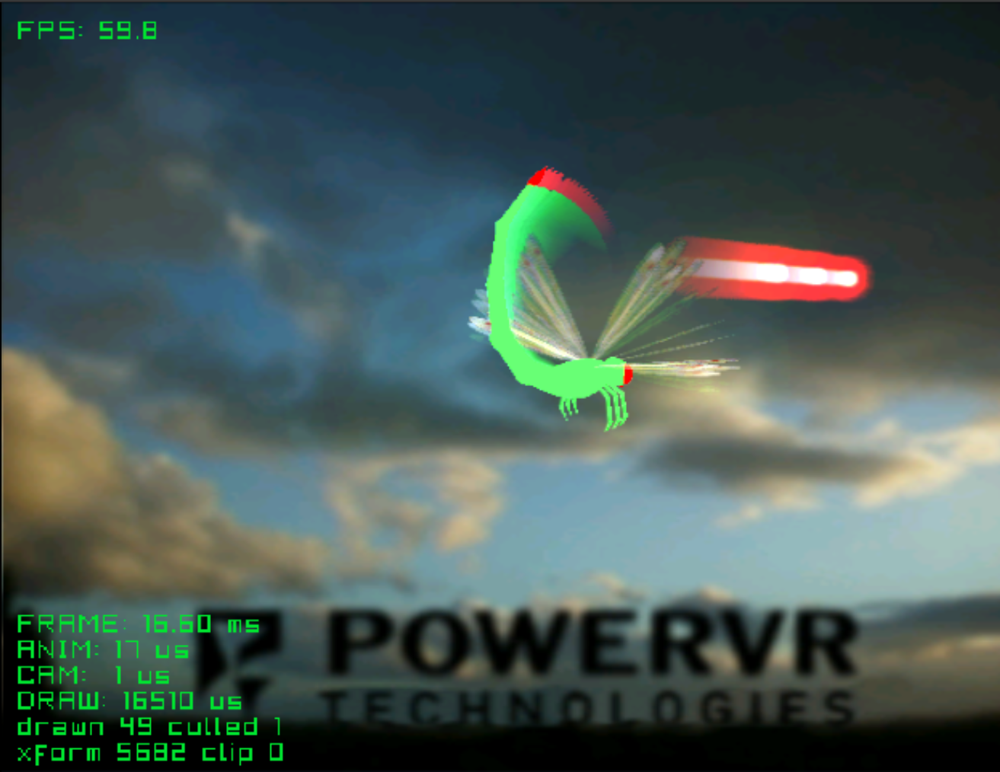
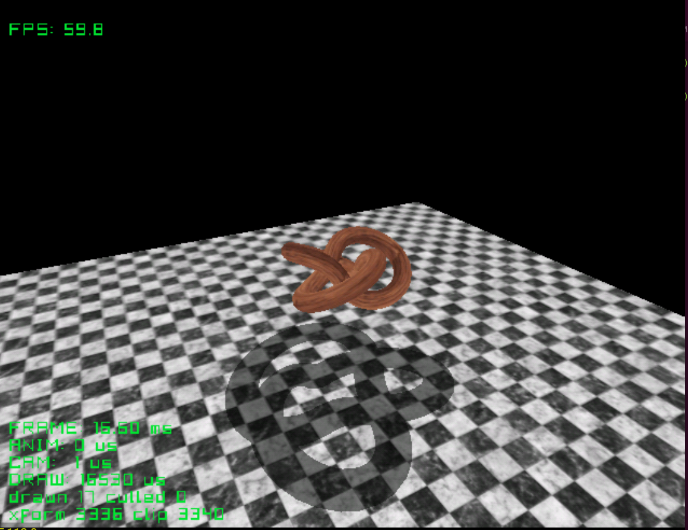
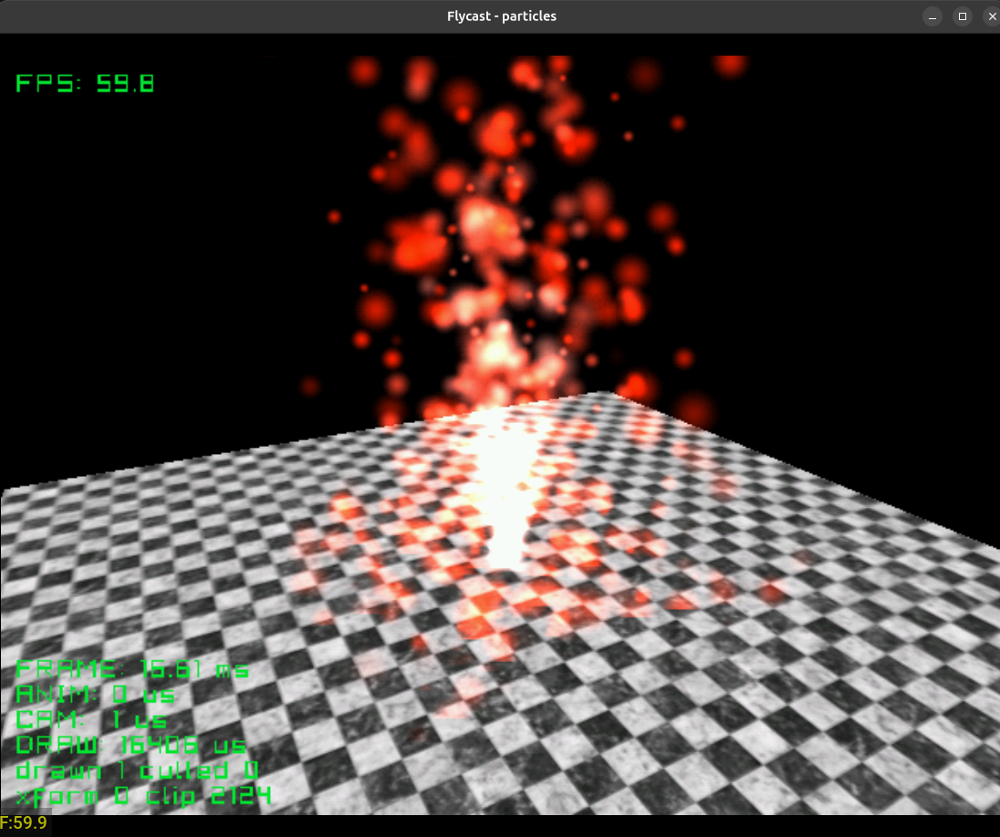

# DMS-Engine

A 3D engine for the Sega Dreamcast, built on KallistiOS and sh4zam. Models are
converted from `.glb` to the engine's `.dms` format with the converter in
`converter/`.

## Building an example

Each example is its own folder with a `Makefile`, a `main.c` and an `assets/`
folder of `.glb` files.

| Command | What it does |
|---|---|
| `make assets` | Converts `assets/*/*.glb` into `pc/` |
| `make` | Builds `test.elf`. Assets are read over dcload from `/pc/` (run `dc-tool` with `-c pc`) |
| `make disc` | Builds `test.elf` reading from `/cd/`, and a `.cdi` named after the folder with `pc/` as the disc root (needs `mkdcdisc`) |

## Examples

### picophysics


Rigid body physics.
(`dms/picophysics.h`). Bodies collide with the level through the engine's
collision grid. A crate and a ball drop at the start, and a wrecking ball
swings on a chain of 14 jointed links.

| Button | Action |
|---|---|
| A | Throw a ball |
| X | Throw a crate |
| Y | Reset |
| Start | Exit |

Credits:
- Level: [GameCube - Mario Kart Double Dash - Block City](https://sketchfab.com/3d-models/gamecube-mario-kart-double-dash-block-city-9d8002b53a884d0290759f05694a49c3)
  by [jkimmel694](https://sketchfab.com/jkimmel694)
- Ball, crate, chain: to add

### bowling


Ten-pin bowling with picophysics. Two lanes of ten pins, and balls rolled from
the camera.

| Button | Action |
|---|---|
| A | Roll a ball |
| Y | Reset the pins |
| Start | Exit |

Credits: to add

### race_track


A large racing track with a car, third-person camera and collision. The
track is close to a worst case for per-mesh overhead: many materials spread
over many small meshes.

Credits:
- Track: [nurburgring (race driver grid ds)](https://sketchfab.com/3d-models/nurburgring-race-driver-grid-ds-fc6393b88aa64fc98e63ee65846d3fc3)
  by [amogusstrikesback2](https://sketchfab.com/amogusstrikesback2)
- Car: to add

### 1st_person


First-person walk through a level with collision. Stresses the near-plane
clipper, since walls and floors are always crossing the camera.

### e1m1


Free camera through Quake's first level, The Slipgate Complex. An indoor
level with baked vertex lighting.

Credits:
- Level: [Quake E1M1 - The slipgate complex](https://sketchfab.com/3d-models/quake-e1m1-the-slipgate-complex-73b496882bce49bb975300ab38295a0b)
  by [barney86](https://sketchfab.com/barney86)

### animation


A skinned, animated character (stand, walk, attack on X) in a level, with a
third-person camera and collision.

Credits:
- Character: [D.Va Base Default - HotS](https://sketchfab.com/3d-models/dva-base-default-hots-ead4a55a18e145338196e10ce4193820)
  by [Catholomew](https://sketchfab.com/Catholomew)

### sonic_streets


Free camera over City Escape from Sonic Adventure 2. A general draw and
culling stress test.

Credits:
- Level: [City Escape - Sonic Adventure 2](https://models.spriters-resource.com/dreamcast/sonicadventure2/asset/297940/)
  ripped by dshaynie, The Models Resource

### highpoly


Free camera over a high-poly model (about 40,000 triangles on screen), to find
the polygon rate limit: about 2.3 million polygons a second. 


Credits:
- Model: [[Free] Ugandan Tails](https://sketchfab.com/3d-models/free-ugandan-tails-cd6dca09d7ed4838b6c0d71c5adc448c)
  by [LuAnton](https://sketchfab.com/LuAnton)

### projector



First-person walk through a room with a TV that shows the room live, from a
camera turning on the projector (render to texture). The TV's screen is a
plain rectangle with a material named `RTT_effect`; one call puts the picture
on it.

Credits:
- Room, TV, projector, table: to add

### dragonfly



The dragonfly from Sega's Katana SDK demo, with motion blur. Its 18 parts move
on their own (no skin). Every frame it is also drawn into a texture over a
faded copy of last frame's texture, and that is added over the screen, so
what moves leaves a trail. Shots are a flat glow drawn additive
(`dc_draw_ex` with `.add`); the trail draws them out into beams.

| Button | Action |
|---|---|
| Stick | Turn the camera around the dragonfly |
| L / R | Zoom |
| X | Fire |
| Start | Exit |

Credits:
- Model and textures: DragonFly demo, Sega Katana SDK (PowerVR / VideoLogic)

### shady



A wooden knot turning over a marble floor, with a flat shadow thrown away from
a light you can move. After Shady from Sega's Katana SDK. The shadow is one
field on the draw (`.shadow`), for any model, moving or not.

| Button | Action |
|---|---|
| Stick | Turn the camera around the knot |
| L / R | Zoom |
| D-pad | Move the light |
| Start | Exit |

Credits: to add

### particles



A fountain of fire over a marble floor: 600 particles thrown up from a spot,
pulled back down and bouncing when they land, grey-pink as they are born, red
at their height, out as they die. After Particles from the PowerVR SDK. The
whole thing is one `dc_particles_create` and one `dc_particles_draw` a frame.

Still a work in progress.. Needs speeding up. 

| Button | Action |
|---|---|
| Stick | Turn the camera around the fountain |
| L / R | Zoom |
| A | Throw a burst of 200 |
| Start | Exit |

Credits:

## Blender settings

Export as `.glb`. The converter reads these from the material (Principled
BSDF):

| Setting | What it does |
|---|---|
| Base Color, and its texture | The colour and texture of the mesh |
| Alpha, or a texture with alpha | Soft alpha makes the mesh transparent, hard alpha makes it a cutout |
| Backface Culling | Off means double sided |
| Metallic, 0.5 or more | The mesh reflects the environment image |
| Roughness, under 0.25 | With Metallic: a mirror |
| Emission | With `-bake`, the material lights the things around it |

IOR and the other settings are ignored.

### Reflections

Set Metallic to 1 on the material.

- A solid material with Roughness at 0 is a mirror: it shows the environment
  image in place of its own texture, tinted by its Base Color.
- A solid material with more Roughness keeps its texture and gets a shine
  over it.
- A see-through material (glass) gets a reflection, cut out by the alpha of
  its texture.

In the example, load the image to reflect and hand it to the engine once:

```c
DCImage* environment = dc_image_load(ASSETS "environment/environment.dt");
dc_set_environment(environment);
```

`make assets` turns `assets/<dir>/<name>.png` into the `.dt`. Without the
`dc_set_environment` call, metallic materials draw as normal. See `vase`.

### Screens (render to texture)

Give the screen its own material in Blender, with any name. It needs no
texture and no UVs: a flat rectangle gets the picture stretched across it,
upright, and at full brightness. In the example, make a target, put it on the
material, then draw into it like the screen:

```c
DCTarget* tv = dc_target_create(256, 256);
dc_target_show_on(tv, world, "RTT_effect");

/* every frame */
dc_set_target(tv);                 /* what follows goes into the TV's picture */
dc_set_camera(&security_cam);
dc_draw(world, origin);
dc_set_target(NULL);               /* back to the screen */
dc_set_camera(&camera);
dc_draw(world, origin);
```

What is drawn into a target is drawn a second time, and a 256x256 target takes
256KB of VRAM.

### Trails (motion blur)

A target drawn into itself is last frame's picture, put behind what is drawn
this frame. A little see-through, it fades frame after frame:

```c
DCTarget* trail = dc_target_create(256, 256);

/* every frame */
dc_set_target(trail);
dc_set_camera(&camera);
dc_draw(ship, pos);
dc_draw_target_ex(trail, &(DCTargetOpts){ .alpha = 0.92f });   /* how much stays */
dc_set_target(NULL);
dc_set_camera(&camera);
dc_draw(ship, pos);
dc_draw_target_ex(trail, &(DCTargetOpts){ .add = true });      /* added over the screen */
```

Only what is drawn into the trail is blurred. While a trail exists the PVR's
dithering is off (with it on, the trail never fades out fully). See
`dragonfly`.

### Flat shadows

A model's shadow on a level floor, thrown away from a light:

```c
DCShadow shadow = { .light = lamp_pos, .floor_y = 0.0f };
dc_draw_ex(knot, &(DCDrawOpts){ .pos = pos, .yaw = yaw, .shadow = &shadow });
```

`.sun = true` makes `light` the way the light shines instead of where it is.
`.dark` is how dark the shadow is (0 to 1, left out it is 0.5). Where the
shadow lies over itself it does not get darker. It only looks right on flat
ground, and it costs about as much as drawing the model again: more when the
shadow fills the screen. It shows on a real Dreamcast; Flycast draws a black
square around it. See `shady`.

### Particles

Fire, smoke, sparks, dust, a fountain. Say once what they look like and how
they move, then draw them every frame:

```c
DCParticles* fire = dc_particles_create(600, &(DCParticleOpts){
    .pos    = fire_place,
    .speed  = { 0, 14, 0 }, .speed_spread = { 2.5f, 6, 2.5f },
    .gravity = 9.8f,
    .life   = 4.0f, .size = 1.2f,
    .start  = 0x998080, .middle = 0xFF2000, .end = 0x000000,
    .rate   = 150.0f, .bounce = true,
});

/* every frame */
dc_particles_draw(fire);        /* moves them and draws them */
```

Each one is a flat square that faces the camera, added over what is behind it,
so black is invisible. `.smoke` mixes them in instead, for dark smoke and
dust. Without `.texture` they get a soft round glow made in code, which is
white, so `.start`, `.middle` and `.end` colour them. `dc_particles_burst()`
throws a lot at once (an explosion), `dc_particles_move()` moves where they
come from (an emitter that follows something).

The whole puff is left out when it is off screen. They cost four vertices
each, so the count is cheap; what costs is the screen they cover, and a camera
inside a cloud of big ones is the slow case. See `particles`.
